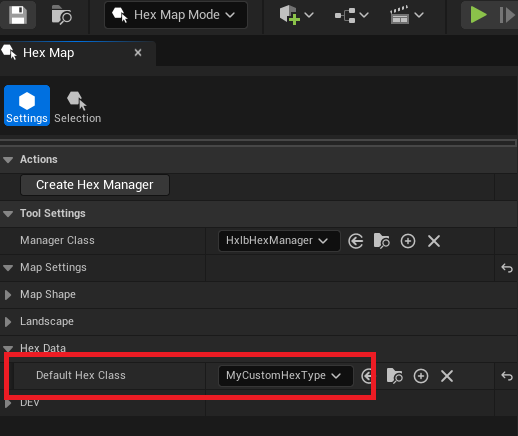
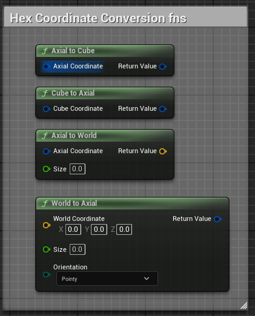

# HexEngine

Author: Mason Stevenson

[https://masonstevenson-dev.github.io/](https://masonstevenson-dev.github.io/)

 

HexEngine is a collection of tools for creating hex grid overlays on top of landscapes in Unreal Engine. This plugin implements a lot of the standard hex operations covered by Amit Patel's excellent [Hexagonal Grids Guide](https://www.redblobgames.com/grids/hexagons/), which as far as I can tell is used by the vast majority of game developers interested in this topic. I highly recommend reading through that article as it is an invaluable resource when it comes to making hex based games.

 

If you are interested in making your own hexgrid projection, I recommend using this project mainly as a learning resource. Not everything here is fully fleshed out, so I can't really recommend this as a "production ready" tool.

 

## Supported Engine Versions

HexEngine currently supports **UE 5.4.**

 

## Required Plugins

This plugin uses my [AnankeCore](https://github.com/masonstevenson-dev/AnankeCore) plugin for logging. You can either install that plugin, or revert the logging back to standard UE logging by flipping the `bUseAnankeLogging` flag to false in `HexLibRuntime.Build.cs` and `HexLibEditor.Build.cs`.

 

## Installation

Install this plugin in your project's plugins folder. The folder structure should be: `YourProject/Plugins/HexEngine/HexLib/Source`.

 

The plugin is enabled by default.

 

## Main Features

## Hex Map Mode

HexEngine provides a new editor mode called "Hex Map Mode". This mode allows users to setup the hex overlay and to associate data with specific hexes.

 

 

To get started, open a map that has a landscape and select "Create Hex Manager". The HexManager is a special actor that gets spawned in the world and tracks all hex data in your scene. You can override the base manager class in the tool settings section.

 

 

Once you create a HexManager, you will see some tool settings and a warning that the overlay has not yet been enabled. Make sure you have a landscape in the scene, then click the "Enable Overlay" checkbox.

 

 

At this point, you should see the hex overlay projection on your landscape. You can change the hex size and map shape from the tool settings. Note that currently only "Pointy" hex orientation is supported.

  

 

The hex overlay is a custom post process material that gets projected onto the game world. You can open up the overlay material and further adjust the hex grid properties, such as line width, edge falloff, and color. When adjusting your material settings, I highly recommend making a **copy** of the default material instance and editing that.

 

 

### Selecting Hexes and Associating Data

HexEngine includes a special selection mode where you can select hexes and edit their data. By default, hexes don't have any special properties associated with them, but you can define additional data to associate with a hex by creating a custom hex class that extends **UHxlbHex**. In the HexMap settings, there is a dropdown to change the default hex class:

 

 

Once you have your hex class set, you can use the selection tool to select various hexes in the scene.

 

 

The selection tool supports the following hotkeys:

* **shift+click** to append to current selection
* **ctrl+click** to remove from current selection
* use **Q** and **E** to cycle through selection modes

 

Once you have made a selection, you should see a new "hex details" panel open in the editor (if for some reason it is closed, you can find it in Window->Details->Hex Details). This details panel works very similarly to the regular actor details panel, but is specific to your current hex selection. Whatever variables you add to your custom hex class can be edited here.

 

 

> [!NOTE] 
>
> Currently there is no built-in visualization for which hexes have data associated with them. So you may find this system cumbersome to use in its current state. In the future, I may implement better visualization features.

> [!CAUTION]
>
> Currently the system does not update existing hexes if you decide to change the default hex class. So if you wish to change the class, you should delete the hex manager and create a new one to avoid hexes having mixed classes.

 

### Masking The Grid Projection

One drawback to the default setup is that the projection is applied to everything in the world, not just the landscape.

 

 

 I've explored several solutions to get around this, and have included three separate options:

* (quickest option) Enable the "Height Mask" option in the PPV material instance parameters.
* (accurate, but expensive option) Enable the "Custom Depth Mask" option in the PPV material instance parameters.
* (best option long term) Disable the landscape overlay and instead put the hexgrid projection logic inside your own custom landscape material.

 

#### Option 1: Height Mask

When you enable the landscape overlay, HexEngine actually captures the heightmap of your landscape heightmap in a render target. This allows the projection material to create a mask based on the height value of a particular pixel on the screen. A bounding region can be chosen so that only pixels that are very close to the landscape actually receive the projection. The result is not exact, because some padding above and below the landscape has to be added to account for how the actual landscape mesh can change based on LOD values. The end result is that objects sitting on top of the landscape appear to not receive the projection, but if you look close, you can see the projection still appears on the parts of those objects that are closest to the landscape (within the bounding region). 

  

 

Also note that with the current implementation, the landscape height render target is not baked down to a texture, and no functionality for recapturing the height and runtime is currently provided. So this feature is really just good as a "preview" of the grid for now.

 

#### Option 2: Custom Depth Mask

With this option, you can exclude an object from receiving the projection by writing that object into the custom depth buffer. This can be accomplished in the details panel for the actor you wish to exclude. Note that writing objects in the the custom depth buffer can be pretty expensive performance-wise. It is not recommended to write hundreds of objects into the depth buffer. For most projects, this option probably isn't practical.

 

 

 

#### Option 3: Integrate into Landscape Material

You can use the same logic that is used by the overlay post process material by including the material function **MF_HexOverlay** in your landscape material.

 

 

If you create a material instance from your base landscape material that uses MF_LandscapeOverlay, you should see all the same landscape overlay options. One important difference when creating your own landscape material is that HexEngine will not compute the size of your landscape automatically for you. Instead you'll need to fill this out yourself. You can enable the overlay and look at the post process material to get your landscape size in cm.

 

 

> [!Note]
>
> Currently, selection mode does not work with custom landscape materials. So you would need to disable your landscape material when using selection mode (and enable the overlay), then disable the overlay (and enable your custom material) when you are done.

 

## HexMath

> [!NOTE] 
>
> Hex math functions can be found in `HxlbMath.h` (c++ and blueprint) and `HexMath.ush` (material graph).

 

HexEngine primarily uses [axial coordinates](https://www.redblobgames.com/grids/hexagons/#coordinates-axial) to describe the position of a hex. Cube coordinates are sometimes used when conversion is necessary. 

 

### C++/Blueprint Math

In C++/Blueprint, HexEngine uses **FIntPoint** to store an axial coordinates and **FIntVector** to store cube coordinates. A set of convenience functions for extracting the components of a axial or cube coordinate are provided (see AXIAL_Q, CUBE_Q, etc). Note that these functions are just to provide a little extra clarity since FIntPoint and FIntVectory use x, y, and z instead of q, r, and s.

 

 

Conversion between axial, cube, and world coordinates are also provided:

 

 

As well as several other coordinate utilities:

 

 

Finally, HexEngine also provides functions for getting arrays of hexes in various shapes:

 

 

### Material Graph Math

Many of the same functions implemented in C++ have also been implemented in HLSL. The main difference between these functions is that HLSL uses float2 to describe axial coordinates and float3 to describe cube coordinates. Because of this, it is possible to have a fractional axial coordinate, even though this does not actually make sense in the context of the hex coordinate system. A rounding function is provided to round fractional coordinates.

 

 

## Known Issues/Limitations

* The hex selection tool currently uses a 256x256 render target for tracking selection state. So the max hexmap size is ~65,000 hexes.
* I only ever got around to implementing pointy hexes. If you want flat hexes, you'll need to go in and implement that math yourself.
* There's a bug where when UE autosaves, the HexEditor mode tool gets reset. For now, just click on one of the hex tools in the mode menu to reopen it.
* For the Height Mask feature, I haven't actually implemented anything that bakes the landscape height down from a render target to a texture. So really this feature is only good for using temporarily in the editor right now.
* Currently there is no built-in visualization for which hexes have data associated with them. So you may find this system cumbersome to use in its current state. In the future, I may implement better visualization features.
* Currently, selection mode does not work with custom landscape materials. So you would need to disable your landscape material when using selection mode (and enable the overlay), then disable the overlay (and enable your custom material) when you are done.